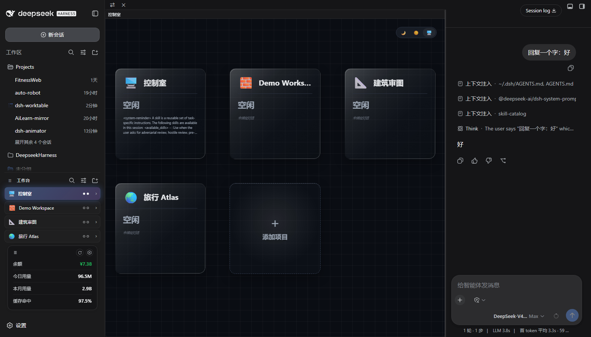
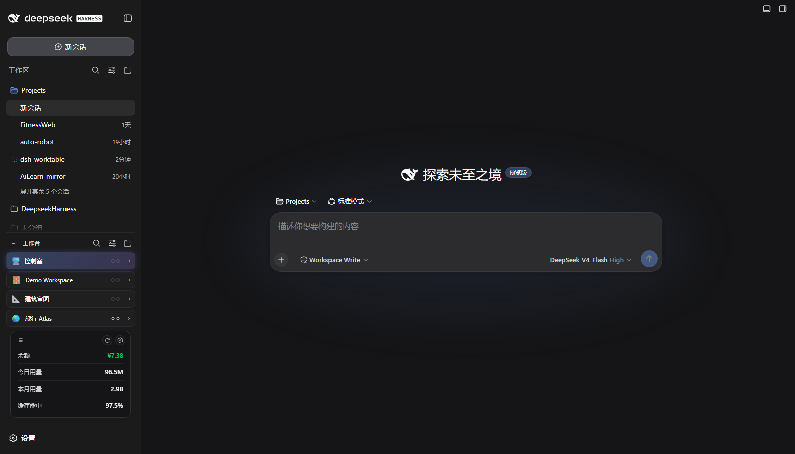
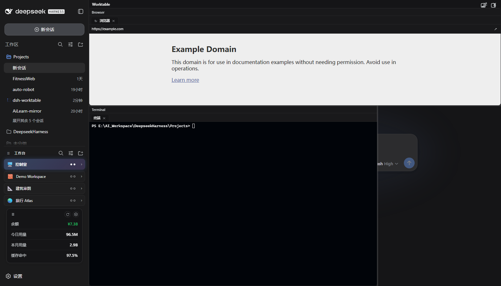

# dsh-worktable 🖥️

<p align="center"><b>English</b> · <a href="README.zh.md">简体中文</a></p>

**An agent-project workbench for DeepSeek Harness** — a sidebar app drawer that turns every project into dockable windows, plus a built-in control room that watches them all in real time.

## 📸 Screenshots

| | |
|---|---|
|  | **🖥️ Control room** — the built-in default project: a live card grid watching every project (working / needs you / done) with glassmorphism cards on a blueprint grid |
|  | **🧩 Worktable sidebar** — the app drawer: projects, shortcuts and the pinned control-room entry |
|  | **🪟 Our projects** — every project opens as a dockable split workspace (resident apps like Travel Atlas included) |

---

## ✨ Feature tour

### 🧩 Sidebar app drawer

- Collects your self-hosted projects (and resident plugins like dsh-travelatlas) in one place
- Rename / icon / reorder / hide each project; per-project folder; **project ↔ conversation binding** — opening a project switches the chat pane to its bound conversation
- Collapse the sidebar and every project becomes a tappable square tile (icon only)

### 🪟 Dockable split workspace

- Declarative layout presets (left column / top row / main grid + right chat pane)
- Draggable dividers, per-pane tabs, per-layout width persistence
- Built-in panes: **file explorer, terminal, browser, animation site, custom window**
- Custom window: send a requirement to a new or existing conversation; the agent builds it and the result auto-mounts into the window (locked)

### 🖥️ Control room (built-in default project)

- A pinned, undeletable first project — bind one management conversation on first open
- 3-column card grid mirrors **every** project: working / needs you / done with live runtime, subagent counts and a cleaned message preview
- Event-driven host snapshot mirroring — **zero polling, zero tokens**
- Glassmorphism cards, dark / light / system theme, neon status glows and a rotating comet on busy cards

---

## At a glance

| | |
|---|------|
| 🧩 Plugin type | Cordis plugin — host routes + web client, pure additive (no official plugin replaced) |
| 🪟 Workspace engine | Self-built split engine rendered into the host shell overlay seat |
| 💬 Chat pane | Reuses the host conversation — the plugin only selects sessions (`sessions.open`) |
| 📡 Status data | Mirror of the host session runtime snapshots (subscription-driven) |
| 💾 State | localStorage only (`dsh.worktable.*`); no workspace files touched |
| 🎨 UI | TypeScript + React (host externals) + vanilla CSS, dark-first with light theme |

---

## Quick start

1. **Install**: `dsh plugin --profile web add "link:<repo>/01_content"` and register `dsh-worktable` in the profile bundle list
2. **Restart** the DSH web process, refresh the GUI
3. **Open the control room**: click the pinned 🖥️ control-room card → bind one conversation (join existing or create new) → you get the live card grid
4. **Create projects**: sidebar ＋ → pick a layout preset, set a project folder

---

## Architecture

One package ships the **host Cordis plugin** and the **web client**:

- **host**: `/api/worktable/*` routes — health, file system, git, file read/write, site serving, mkdir, workspaces, native skin template; WebSocket `/api/worktable/term` for the terminal pane (PowerShell on Windows)
- **client**: injected into the sidebar and the shell overlay via the slot protocol; the split engine, tab model, drag/drop and persistence are self-built
- **control room**: reads the host session list snapshot (running / pending / completed, jobs, subagent catalogs) — an event-driven mirror, no model involvement
- **window tasks**: the agent writes `widget-result.json` into the project folder on completion; the client mounts the artifact into the addressed window and locks it

---

## Development & testing

```bash
cd 01_content
npm install
npm run build     # lib/index.js + lib/client.js
node --check lib/index.js
```

- **Build must run inside `01_content`** — building from the repo root writes `lib/` to the wrong place while the host keeps loading the old bundle
- The client bundle keeps the `window.__ModuleLoader__.load` handshake; `react` and `@deepseek-ai/*` stay external
- Regression: `04_test/functional-diag.cjs` (20 steps) plus targeted probes (control room, bind panel, collapsed rail, model inheritance)

---

## Known limits

- State lives in the browser (`localStorage`) — projects, bindings and views do not sync across machines
- The terminal pane is a plain PowerShell host on Windows (no PTY feature parity with the native terminal app)
- Auto-mount requires the agent to actually write `widget-result.json` in the project folder
- The control room monitors projects that are **bound** to a conversation; unbound projects show as idle

---

## Privacy

No telemetry, no network calls beyond the host APIs and the plugin routes. All user state stays in localStorage.

---

## License

MIT

## Related

- [dsh-reminder](https://github.com/Aisland-SJL/dsh-reminder) — cross-window completion & approval notifications
- [dsh-usage](https://github.com/Aisland-SJL/dsh-usage) — persistent balance/usage dock
